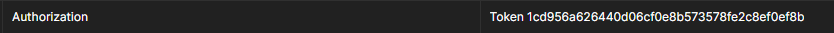

# M7011E-Simulation
This is the simulation service component of the [microservice-system](github.com/WeRiano/M7011E) created for the course M7011E at
Luleå Tekniska Universitet. 

# How it works

This service simulates a simple supply and demand scenario which can only be accessed and interacted
with by users defined by the
[M7011E-Backend](https://github.com/WeRiano/M7011E-Backend) service through the [REST API](#api-documentation).

There exist some natural wind speed and temperature conditions which dedicate how much 
electricity a users wind-turbine is generating. This generated electricity is then subtracted
by a simulated household consumption to create an over-production or under-production
of energy.

In the case of over-production, the energy can either be stored in a power-bank (buffer) 
and then be used for later. It can also be sold on a market at some simulated market price.

In the case of under-production, the net-negative amount of energy has to be either taken
from the buffer or bought from the market. 

How much energy should be stored or sold and used or bought is controlled by the user.

The selling and buying of power will affect the users bank which can either be a positive or negative
amount of money (earned or owed). 

In this simulation the conditions are calculated for the following hour. 
Each time the simulation is updated an hour passes and the aforementioned conditions 
are updated accordingly. The user can control how often the simulation should proceed by changing the 
'wait-time' between each update.

Since each user has their own simulation instance the service is dependent on the 
[M7011E-Backend](https://github.com/WeRiano/M7011E-Backend) service and will not work if it cannot
communicate with it or if the backend is down.

Admin users can access other non-admin users simulation instances just like the user itself would.
They can also have the exclusive permission to restart the instance.

For installation instructions and more, see the [README](https://github.com/WeRiano/M7011E/blob/main/README.md) 
of the overall system.

# API Documentation

All HTTP endpoints are located under the following base url:

`<service_ip>:<service_port>/api/`. 

You must then specify which version of the API that you intend to use by appending `version/<version_nr>/` 
to the base url.

All endpoints return a response in JSON format.

## `api/version/1/`

### Authorization Token

Each endpoint described below requires an authorization token. 
This token will be used to verify and access the users specific simulation instance. 
This token can be acquired from the backend service by creating an account and then logging in 
(see the `users/` and `token/login` endpoints in the 
[M7011E-Backend](https://github.com/WeRiano/M7011E-Backend]) service).

The token has to be provided as an `Authorization` HTTP header in the following format:

`Token <hash>`

Below is an example screenshot from Postman

### GET `get_current_conditions/<conditions>/`

Returns the current simulation conditions given by the
`conditions` parameter. This parameter is a "slug", 
a hyphen seperated list of conditions. 

The following conditions exists:

* `date_time` - Current simulation time and date.
* `delta` - Simulation update frequency in seconds.
* `saving` - A fraction on the interval `[0.0, 1.0]` which describes
how much energy should be stored in the case of over-production.
* `using` - A fraction on the interval `[0.0, 1.0]` which describes
how much energy should be used in the case of under-production.
* `wind_speed` - Simulation wind speed in meters per second.
* `temperature` - Simulation temperature in degrees Celsius.
* `market_price` - Market price of electricity in 
Swedish krona per kilowatt-hour.
* `prod_power` - Energy production from the wind turbine
in kilowatt-hour.
* `buffer_capacity` - Energy stored in the buffer in kilowatt-hour.
* `consumption` - Energy consumption by the users "household" in kilowatt-hour.
* `bank` - Amount of money stored in the users digital wallet.
A negative amount means that the user is "in depth".

#### Examples

`127.0.0.1:7999/api/version/1/get_current_conditions/all/`
`127.0.0.1:7999/api/version/1/get_current_conditions/temperature-wind`
`127.0.0.1:7999/api/version/1/get_current_conditions/temperature-wind`

### POST `set_buffer_settings/<saving>/<using>/`

Changes the ``saving`` and ``using`` conditions of the simulation to the given values. Each parameter must be a decimal 
on the interval `[0.0, 1.0]` which describes how much energy should be stored in the buffer in the case of over-production 
(``net_pos_energy * saving = buffer_energy_stored``) and
how much energy should be used from the buffer in the case of under-production 
(``net_neg_energy * using = buffer_energy_used``), respectively.

The remaining energy that isn't stored in the case of over-production is sold on the market.
The remaining energy that isn't used in the case of under-production is bought from the market.

#### Examples

`127.0.0.1:7999/api/version/1/set_buffer_settings/0.0/0.9/`
`127.0.0.1:7999/api/version/1/set_buffer_settings/1.0/1.0/`

### POST `set_update_frequency/<delta>/`

Changes the `delta` condition which describes the time in seconds between simulation updates. This `delta` value must
be a number on the interval `[5, 3600]`.

Note that the new `delta` will not take place until the next simulation update has occurred.

#### Examples

`127.0.0.1:7999/api/version/1/set_update_frequency/15/`
`127.0.0.1:7999/api/version/1/set_buffer_settings/3599.999/`

### Admin endpoints

All endpoints described previously have an admin version. This can be accessed by appending a user id 
in the form of an integer at the end of the url:

`endpoint_url/<user_id>/`

this will perform the described operation for the instance owned by the user with the given `user_id`
rather than for the instance owned by the user with the given authentication token.

By using an admin version of an endpoint you have to provide an authentication token that belongs to 
a superuser (admin verified account).

#### Examples

`127.0.0.1:7999/api/version/1/get_current_conditions/all/2/`
`127.0.0.1:7999/api/version/1/set_buffer_settings/0.5/0.4/3/`
`127.0.0.1:7999/api/version/1/set_update_frequency/15/4/`

In addition to these admin endpoints there is also an admin-only endpoint as described below:

### `admin/reset_simulation/<user_id>/`

Restarts the simulation owned by the user with the given `user_id`.

#### Examples

`127.0.0.1:7999/api/version/1/admin/reset_simulation/4/`
`127.0.0.1:7999/api/version/1/admin/reset_simulation/95/`
